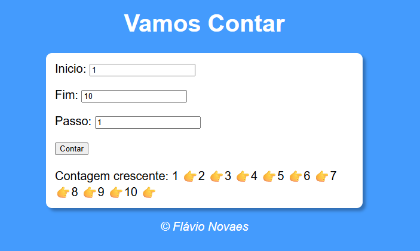
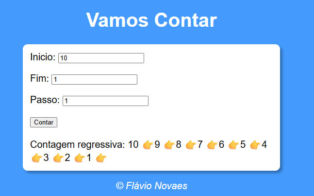

🔢 Vamos Contar

Projeto simples desenvolvido em **HTML, CSS e JavaScript**, que permite realizar uma **contagem personalizada**, definindo o **início**, o **fim** e o **passo** da contagem. O sistema identifica automaticamente se a contagem será crescente ou regressiva, exibindo os números de forma dinâmica na tela.

Este projeto foi desenvolvido com base nas aulas do Curso em Vídeo, ministradas por Gustavo Guanabara, como parte dos estudos iniciais em JavaScript.


---

## 🖼️ Preview do Projeto

### 📈 Contagem Crescente


### 📉 Contagem Regressiva


## 🚀 Funcionalidades
- Permite definir:
🔹 Número inicial
🔹 Número final
🔹 Passo da contagem

- Realiza contagem automática:
- 📈 Crescente
- 📉 Regressiva

- Exibe os números dinamicamente na tela
- Utiliza emojis para representar visualmente a contagem
- Caso o passo seja zero, identifica e considera passo 1
- Interface simples e interativa

---

## 🛠️ Tecnologias Utilizadas
- **HTML5**
- **CSS3**
- **JavaScript**

---

## 📂 Estrutura do Projeto
```text
📁 Vamos-Contar
├── contador.html
├── style.css
├── script.js
```

## ▶️ Como Executar o Projeto
1. Faça o download ou clone este repositório:
```bash
git clone https://github.com/FlavioNovaes/Vamos-Contar.git
```
2. Abra o arquivo index.html diretamente no navegador

---

## 📚 Aprendizados

Com o desenvolvimento deste projeto, foi possível praticar e compreender melhor:

- Estrutura de repetição for no JavaScript
- Uso de condições (if, else) para controlar fluxos
- Operadores lógicos na tomada de decisão
- Validação de dados de entrada
- Manipulação do DOM para exibir resultados dinâmicos
- Lógica para contagem crescente e regressiva
- Integração entre HTML, CSS e JavaScript
